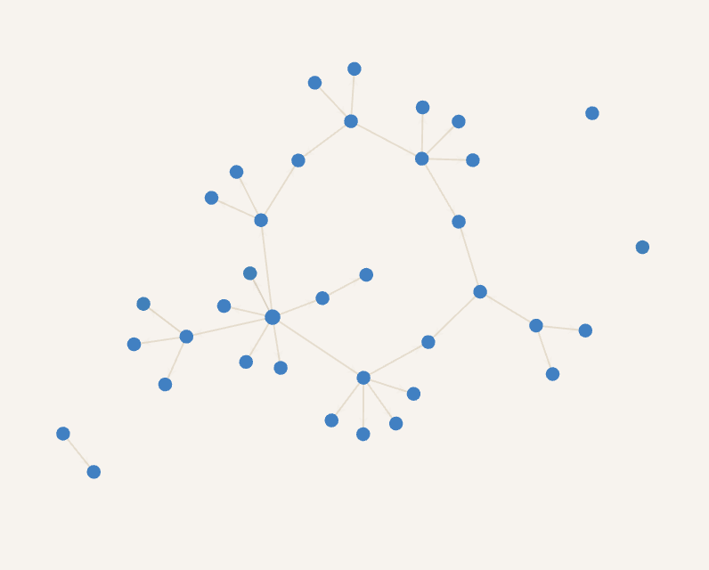

#### 2021 总结
##### 技术方向
- 自建 git + drone + portainer, 完成前端静态页 + nodejs 服务端的 CI/CD (单机)
- 翻了翻 antd 的源码, 对 ts 的理解又深刻一些
- nodejs 开发服务端, 暴露 metrics 对接了 Prometheus + grafana 进行指标监控(还需深入了解)
- 接触一些新东西  参考 [[常用 js 库框架]], 听过一些技术名词: monorepo, ESM Bundleless, web3, low code(ui / state(xstate) / 逻辑(iMove))
- 看了一些书, 做了些笔记 [[读书笔记汇总]]
- 做了一些算法题, 目前只做了部分 数组相关的题

- 放张关系图助助兴 

##### 电子设备
- 卖了我的 2015 款老 mac TAT, 买了m1 mac -.-
- 咸鱼收个志强, 自己组了个家用服务器
- 搞了个树莓派扔公司备用, 跑点稀奇古怪的东西

##### 旅游
[[云南]]
长沙

#### 2022 规划
##### 技术方向
1. 单测
2. 深入 TS
3. 深入 React + 周边生态 **源码** (umi, dva, ahook, redux, mobx, axios)
4. webpack/ esbuild / vite / babel 深入的了解
5. node 一些模块源码, libuv 也要了解. 负载均衡的处理, node 并发处理
6. Rust 学起来
7. 算法题刷起来
8. 看书📚

##### 旅游
说走就走, 不一定去哪